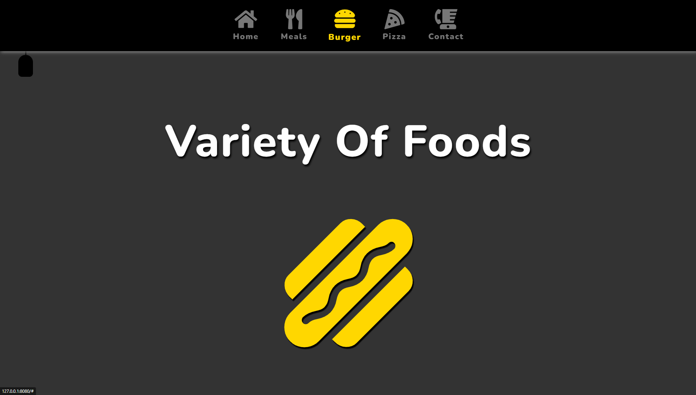

# 🍔 The Foods Website 🍕

A simple, responsive, and visually appealing food-themed website that showcases a variety of foods and popular meals. It includes an interactive gallery, a dynamic menu, and a signup form for receiving updates.

---

## 🖼️ Screenshot




## 📌 Features

- **🍽️ Navbar**: Easy navigation with icons for different sections like Home, Meals, Burger, Pizza, and Contact.
- **🍔 Food Icons**: Rotating food icons to add interactivity and fun.
- **🍕 Popular Meals**: A section displaying different meal cards (e.g., Fish, Cake, Lobster) with images and "Order Now" buttons.
- **📸 Gallery**: An interactive gallery of delicious food images with descriptions of various dishes like Pancakes, Cupcakes, and more.
- **📝 Footer**: A signup form where users can enter their email to receive updates on new products.
- **💻 Responsive Design**: Optimized for both mobile and desktop screens.

---

## 🎯 Purpose

This project was created to practice and demonstrate web development skills, including responsive design, semantic HTML5, CSS3 styling, and JavaScript interactivity.

---

## 🛠️ Technologies Used

- **HTML5**: Structure of the website.
- **CSS3**: Styling and layout (custom `style.css`).
- **JavaScript**: Interactive functionality for the rotating food icons and menu toggle (custom `script.js`).
- **Font Awesome**: Icons for navigation and food images.
- **Responsive Design**: Flexbox and media queries for a mobile-friendly layout.

---

## 🏗️ Installation & Setup

To view or modify this project locally:

1. Clone the repository:
   ```bash
   git clone https://github.com/BothSann/thefoods-website.git

---

## 👨‍🍳 Author

© Copyright by **THANN SOPHEAKBOTH** - *Creator of the project*


